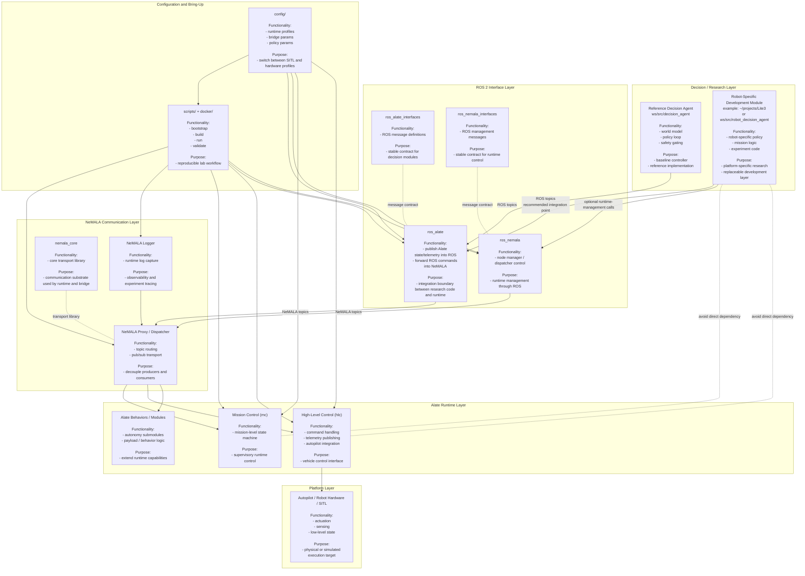

# Stack Architecture and Modularity

This document describes the current stack architecture, the role of each
module, and the correct integration point for future robot-specific development
modules.

## Architecture Diagram



## Module Breakdown

| Module | Location | Functionality | Purpose in the system |
| --- | --- | --- | --- |
| Reference Decision Agent | `ws/src/decision_agent` | Maintains a world model, subscribes to ROS outputs, and publishes commands | Serves as the baseline decision layer and a reference for new controllers |
| Robot-Specific Development Module | Example: `~/projects/Lite3` or `ws/src/robot_decision_agent` | Implements robot-specific policy logic, state estimation assumptions, mission logic, and experiments | Main place for future development without coupling research code to Alate internals |
| `ros_alate` | `ws/src/ros_alate` | Bridges ROS command topics to NeMALA and publishes Alate state, telemetry, and errors into ROS | Defines the operational integration boundary between decision code and runtime |
| `ros_alate_interfaces` | `ws/src/ros_alate_interfaces` | Defines ROS messages for commands, state, telemetry, and errors | Creates a stable interface contract for all decision modules |
| `ros_nemala` | `ws/src/ros_nemala` | Exposes dispatcher and node-management functionality through ROS | Supports runtime lifecycle and management flows |
| `ros_nemala_interfaces` | `ws/src/ros_nemala_interfaces` | Defines ROS messages for runtime-management operations | Keeps management interactions explicit and versioned |
| NeMALA Proxy / Dispatcher | Runtime service | Routes messages between runtime modules and bridge nodes | Decouples message producers and consumers and preserves modularity |
| NeMALA Logger | Runtime service | Captures logs from the NeMALA communication layer | Supports observability, debugging, and experiment traceability |
| `nemala_core` | `external/nemala_core` | Provides the communication substrate used by NeMALA-based components | Shared low-level transport foundation |
| Mission Control (`mc`) | `external/alate` build output | Runs mission-level state transitions and supervisory logic | Coordinates vehicle-level runtime behavior |
| High-Level Control (`hlc`) | `external/alate` build output | Handles command execution, autopilot integration, and telemetry publication | Connects runtime decisions to the platform |
| Behaviors / Alate Modules | `external/alate` | Optional autonomy, payload, or behavior extensions | Extends runtime capabilities below the decision layer |
| Autopilot / Hardware / SITL | External platform | Executes low-level motion and exposes platform state | Final execution target, either simulated or physical |
| Configuration Profiles | `config/` | Stores runtime, bridge, and algorithm parameters | Allows the same architecture to move between SITL and hardware-specific setups |
| Bring-Up and Validation Tooling | `scripts/`, `docker/` | Builds, starts, validates, and stops the stack | Makes experiments reproducible across developers and platforms |

## Where the New Development Module Belongs

The module you will implement for a specific platform, such as a robot-specific
package in `~/projects/Lite3`, belongs in the **Decision / Research Layer**.

Its dependency boundary should be:

- consume ROS state, telemetry, and error topics
- publish ROS command topics
- remain independent from `external/alate` internal classes
- avoid direct use of NeMALA transport internals unless you are explicitly
  extending the bridge layer

In other words, the correct dependency path is:

```text
Robot-Specific Development Module
    -> ROS 2 topics and messages
    -> ros_alate / ros_nemala
    -> NeMALA proxy
    -> Alate runtime
    -> hardware or SITL
```

The module should **not** depend directly on:

- `mc` internal implementation details
- `hlc` internal implementation details
- raw NeMALA transport code for normal policy logic

## Practical Integration Guidance for a Robot-Specific Module

For a development package such as `~/projects/Lite3`, the recommended approach
is:

1. Keep the module in its own ROS package or repository if it represents a
   distinct robot program.
2. Subscribe to the ROS interface contract exposed by this repository.
3. Publish velocity or operator-command topics back through the same ROS
   interface layer.
4. Add hardware-specific parameters through configuration, not through direct
   edits to Alate runtime code.
5. Extend the bridge packages only when the platform truly requires new command
   types, telemetry fields, or error semantics.

This preserves the main modularity goal of the stack: decision logic remains
replaceable, while the integration and runtime layers remain stable.
